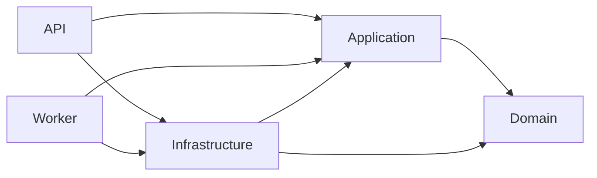
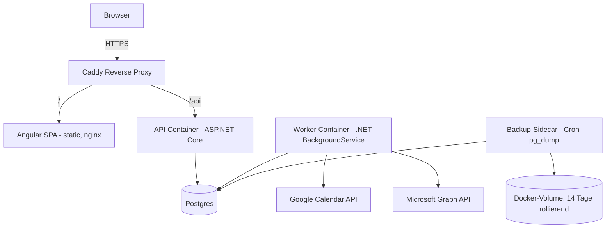
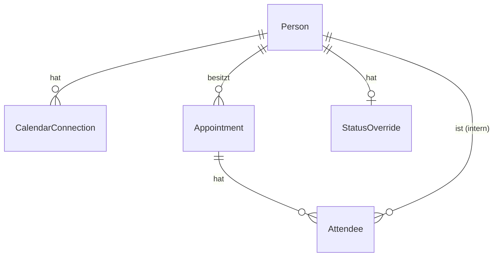

# Architecture Spine — Team-Terminkalender mit Synchronisation

## Design Paradigm

**Layered/Clean Architecture** im .NET-Backend, mit **Ports & Adapters** für die Kalender-Provider-Integration:

- **Domain** — Entitäten, Status-Heuristik, Privat-Default-Regeln. Kennt nichts außerhalb seiner selbst.
- **Application** — Use-Cases, der zentrale Termin-Leseservice (Privat-Default-Durchsetzung), Interfaces für Provider-Adapter (`ICalendarProvider`) und Verschlüsselung.
- **Infrastructure** — EF Core/Postgres, konkrete Provider-Adapter (`GoogleCalendarProvider`, `OutlookCalendarProvider`), Token-Verschlüsselung.
- **API** und **Worker** — zwei separate Composition-Roots (siehe AD-9), beide referenzieren Application + Infrastructure, nie umgekehrt.

Frontend (Angular) ist ein eigenständiger Client, der ausschließlich über die API-Schicht mit dem System spricht — kein eigenes Paradigma nötig, aber die Konventionen unten (Fehlerformat, i18n-Trennung) binden es ein.



## Invariants & Rules

### AD-1 — Layered/Clean Architecture mit Innen-nach-außen-Abhängigkeitsregel [ADOPTED]

- **Binds:** alle Backend-Komponenten (API, Worker, Infrastructure, Application, Domain)
- **Prevents:** Business-Regeln (Status-Heuristik, Privat-Default), die an EF-Core-Entitäten, HTTP-Konzepte oder Provider-SDKs koppeln und dadurch pro Feature unterschiedlich reimplementiert werden
- **Rule:** Domain hat keine Abhängigkeit auf Application/Infrastructure/API/Worker. Application hängt nur von Domain ab. Infrastructure implementiert die von Application/Domain definierten Interfaces. API und Worker sind reine Composition-Roots.

### AD-2 — Kalender-Provider als Ports & Adapters

- **Binds:** FR-5, FR-6, FR-7
- **Prevents:** Provider-spezifische Logik (Google-/Microsoft-Graph-Eigenheiten), die sich in die Sync-Orchestrierung einschleicht und einen dritten Provider oder einen Provider-Wechsel zum Rewrite macht; ein Adapter, der Schreibzugriffe gegen den Provider ermöglicht und damit FR-7 unterläuft
- **Rule:** Der Worker kennt ausschließlich das Application-Interface `ICalendarProvider` mit genau einer Methode, `FetchAllEvents(connection, window)` — sie liefert bei jedem Aufruf den **vollständigen aktuellen Terminbestand** des Kontos im betrachteten Zeitfenster (volles Snapshot, kein Delta/Incremental-Sync), damit AD-7's "fehlt im aktuellen Abruf → löschen"-Regel funktioniert. `ICalendarProvider` definiert bewusst keine Schreibmethode (kein `CreateEvent`/`UpdateEvent`/`DeleteEvent`) — FR-7 wird dadurch strukturell erzwungen, nicht nur durch Konvention. `GoogleCalendarProvider` und `OutlookCalendarProvider` sind austauschbare Infrastructure-Implementierungen; kein Aufrufer außerhalb von Infrastructure kennt Google- oder Microsoft-spezifische Typen.

### AD-3 — Zentrale Privat-Default-Durchsetzung

- **Binds:** FR-2, FR-4, FR-8, FR-9, FR-15
- **Prevents:** Ein neuer Lesepfad (Kalenderansicht, Mehrpersonen-Ansicht, künftiger Slot-Finder) vergisst die Privat-Default-Filterung, implementiert die Teilnehmer-Ausnahme (FR-9) abweichend, oder baut für die Mehrpersonen-Ansicht eine eigene, zweite Filter-Implementierung um ein N+1-Problem zu umgehen
- **Rule:** Jeder Lesezugriff auf einen fremden Termin läuft durch genau einen Application-Service (`AppointmentViewService`), der anhand von Eigentümerschaft/Teilnahme entscheidet, ob volle Felder oder nur "privat/beschäftigt" + Status zurückgegeben werden. `AppointmentViewService` bietet dafür zwingend auch eine Bulk-Methode (`GetForViewers(personIds, range, viewerId)`) für die Mehrpersonen-Ansicht (FR-2) — sie wendet dieselbe Filterregel in einer Abfrage an, statt dass ein zweiter Codepfad die Regel für "mehrere Personen gleichzeitig" eigenständig nachbaut. Kein Repository- oder Controller-Code liest Termin-Rohdaten für einen Viewer, der nicht Eigentümer ist, ohne durch diesen Service zu gehen. Rein clientseitige Filterung erfüllt diese Regel nicht (PRD FR-9). Die Teilnehmer-Ausnahme (FR-9) gilt für native **und** synchronisierte fremde Termine gleichermaßen — eine Einschränkung der Ausnahme auf nur native Termine (wie eine wörtliche Lesart von FR-9 nahelegen könnte) würde zwei unterschiedliche Sichtbarkeitsregeln je nach Terminquelle erfordern; diese Architektur-Entscheidung löst die im PRD offen gebliebene Formulierungsambiguität zugunsten einer einzigen, quellenunabhängigen Regel auf.

### AD-4 — Status-Heuristik: vorausberechnet, ein einziger Domain-Service

- **Binds:** FR-3, FR-5, FR-6, FR-10, FR-14
- **Prevents:** API und Worker berechnen den Verfügbarkeits-Status unterschiedlich, oder ein Lesepfad zeigt einen veralteten/inkonsistenten Status
- **Rule:** `StatusHeuristicService.Compute(appointment)` (Domain) ist die einzige Implementierung der Heuristik. Sie wird bei jedem Schreibzugriff auf einen Termin aufgerufen — nativ (API, FR-3) wie synchronisiert (Worker-Upsert, FR-5/FR-6) — und das Ergebnis wird als Feld am Termin gespeichert. Lesezugriffe lesen ausschließlich dieses gespeicherte Feld, keine Neuberechnung pro Request.

### AD-5 — Heuristik-Kalibrierung (löst PRD Offene Frage #3) [ADOPTED]

- **Binds:** FR-10
- **Prevents:** Zwei Implementierungen von FR-10 setzen unterschiedliche Zahlenwerte für "kurz"/"lang" an und stufen denselben Termin unterschiedlich ein
- **Rule:** Ein gemeinsamer Domain-Enum `AvailabilityStatus { Unterbrechbar, BitteNichtStoeren }` (siehe auch AD-6 — dieselbe Definition, keine zweite Werteliste) wird wie folgt berechnet: Kein Teilnehmer → immer `Unterbrechbar`, unabhängig von Dauer. Mit mindestens einem Teilnehmer: Dauer ≤ 45 Minuten → `Unterbrechbar`. Ganztägig ODER (Dauer ≥ 90 Minuten UND ≥ 3 Teilnehmer) → `BitteNichtStoeren`. Alle übrigen Fälle (46–89 Minuten, oder ≥ 90 Minuten mit < 3 Teilnehmern) → `Unterbrechbar`. Tageszeit fließt nicht in die Berechnung ein. Kein aktiver Termin zum aktuellen Zeitpunkt → `Unterbrechbar` (Default).

### AD-6 — Status-Override als eigenständige, nutzerbezogene Entität [ADOPTED]

- **Binds:** FR-11
- **Prevents:** Der Override wird fälschlich als Feld am Termin statt am Nutzer modelliert, wodurch er beim nächsten Sync überschrieben würde oder mit dem Ende des ursprünglich aktiven Termins verschwände; zwei verschiedene UI-Oberflächen (Mehrpersonen-Spalte, Detail-Popover, künftiger Slot-Finder) berechnen "der aktuelle Status von Person X" jede für sich und kommen zu unterschiedlichen Ergebnissen
- **Rule:** `StatusOverride` ist eine eigene Entität mit `PersonId`, `Status` (`AvailabilityStatus?` aus AD-5, `null` = automatisch), `SetAt` — kein Bezug zu einer Termin-Instanz, kein Ablaufzeitpunkt. Genau ein Application-Service, `CurrentStatusService.GetCurrentStatus(personId, now)`, ist die einzige erlaubte Quelle für "der aktuelle Status von Person X gerade jetzt": Override, falls gesetzt; sonst der vorausberechnete Status (AD-4/AD-5) des gerade aktiven Termins; sonst `Unterbrechbar`. Überlappen sich für dieselbe Person zwei aktive Termine mit unterschiedlichem Status, gilt der strengere Wert (`BitteNichtStoeren` sticht `Unterbrechbar`) — kein UI-Pfad darf einen anderen Tie-Break implementieren.

### AD-7 — Sync-Idempotenz über Provider-Event-ID [ADOPTED]

- **Binds:** FR-5, FR-6
- **Prevents:** Ein verschobener oder erneut abgerufener Termin erzeugt einen Duplikat-Eintrag statt eines Updates; ein Schema-Autor vergibt für native Termine einen Platzhalter statt `NULL` bei `Provider`/`ProviderEventId` und lässt dadurch den Unique-Index beim zweiten nativen Termin einer Person fehlschlagen
- **Rule:** `(PersonId, Provider, ProviderEventId)` ist ein **partieller** eindeutiger Index auf `Appointment`, gültig nur `WHERE ProviderEventId IS NOT NULL` — native Termine (FR-3) haben `Provider`/`ProviderEventId` zwingend `NULL`, nie einen Platzhalterwert. Jeder Sync-Zyklus upsertet anhand dieses Schlüssels gegen den vollständigen Snapshot aus AD-2; fehlt ein zuvor importierter Schlüssel im aktuellen Abruf, wird der Termin (inkl. abgeleitetem Status) entfernt.

### AD-8 — OAuth-Tokens verschlüsselt at rest

- **Binds:** FR-5, FR-6, Zugriffsschutz-NFR
- **Prevents:** Ein reiner DB-Zugriff (Backup, Leak, kompromittiertes Backup-Volume) gibt direkten Zugriff auf Outlook-/Google-Konten; API und Worker aktualisieren denselben Token gleichzeitig und überschreiben sich gegenseitig
- **Rule:** Access-/Refresh-Tokens werden nie im Klartext persistiert. Verschlüsselung erfolgt anwendungsseitig (symmetrischer Schlüssel aus einer Umgebungsvariable/Secret-Datei, nie im Repository); Entschlüsselung ausschließlich innerhalb von Infrastructure, unmittelbar vor einem Provider-API-Aufruf. Der Token-Refresh-Schreibzugriff auf `CalendarConnection` gehört ausschließlich dem Worker (er ist der einzige Aufrufer von `ICalendarProvider`, siehe AD-2/AD-11); die API schreibt auf `CalendarConnection` nur beim initialen OAuth-Handshake (einmaliger Code-Austausch beim "Verbinden"-Klick), nie einen Refresh.

### AD-9 — Entkoppelte Authentifizierung

- **Binds:** Zugriffsschutz-NFR, Rollenmodell (Admin/Member)
- **Prevents:** Login-Fähigkeit wird an eine sofortige Kalender-OAuth-Zustimmung gekoppelt und unterläuft damit die UX-Entscheidung, dass das Verbinden eines Kalenders ein optionaler, späterer Schritt ist
- **Rule:** Login läuft über ASP.NET Core Identity (E-Mail + Passwort), Accounts werden ausschließlich von einem Admin angelegt (kein Self-Signup). Login ist vollständig unabhängig von den Settings→Calendar-Connections-OAuth-Flows (FR-5/FR-6); ein Nutzer kann eingeloggt sein, ohne je einen Kalender verbunden zu haben.

### AD-10 — Session-Auth same-origin, keine clientseitig gespeicherten Tokens

- **Binds:** alle authentifizierten API-Zugriffe
- **Prevents:** Ein Bearer-Token im Browser-Storage (XSS-Angriffsfläche) oder CORS-Konfiguration, die pro Endpoint unterschiedlich gehandhabt wird
- **Rule:** Angular und API laufen hinter demselben Reverse Proxy unter derselben Origin (Pfad-Routing: `/` → Angular-Static, `/api` → Backend). Authentifizierung erfolgt über ein HttpOnly-, Secure-, SameSite=Lax-Cookie. Kein Access-Token wird an clientseitigen JavaScript-Code ausgeliefert.

### AD-11 — Worker und API teilen eine Codebasis, koordinieren nur über die DB

- **Binds:** FR-5, FR-6, FR-10
- **Prevents:** Der separate Worker-Container reimplementiert Status-Heuristik, Dedup-Regel oder Privat-Default-Modell abweichend von der API
- **Rule:** Worker und API referenzieren dieselben Domain-/Application-/Infrastructure-Bibliotheken (ein Repository, gemeinsame NuGet-Projektreferenzen, kein Duplikat-Code). Die einzige Kopplung zwischen beiden Prozessen ist die gemeinsame Postgres-Datenbank; kein direkter Prozess-zu-Prozess-Aufruf (kein RPC, keine Shared-Memory-Kopplung).

### AD-12 — Deprovisionierung ist Soft-Deaktivierung [ADOPTED]

- **Binds:** Rollenmodell, FR-2, FR-5, FR-6
- **Prevents:** Ein Team-Wechsel reißt Lücken in fremde Terminhistorien/Teilnehmerlisten (Hard-Delete) oder ein deaktiviertes Konto behält versehentlich Kalenderzugriff/Login
- **Rule:** Deaktivierung eines Teammitglieds (Admin-Aktion) setzt `Person.IsActive = false`, sperrt Login sofort, löscht/widerruft alle zugehörigen OAuth-Tokens, stoppt den Sync für dieses Konto und schließt die Person aus der Personenauswahl (FR-2) aus. Native Termine, Teilnahmen an fremden Terminen und Attendee-Einträge sowie ein eventuell gesetzter `StatusOverride` bleiben unverändert erhalten — kein Hard-Delete, keine Kaskadenlöschung. Der Worker prüft `IsActive` zu Beginn jedes Sync-Zyklus pro Person (nicht aus einer zwischengespeicherten Liste) — ein bereits laufender Zyklus für eine gerade deaktivierte Person darf zu Ende laufen, der nächste Zyklus überspringt sie.

### AD-13 — Backend liefert Fehlercodes, keine lokalisierte Prosa

- **Binds:** i18n-Foundation (Deutsch/Englisch)
- **Prevents:** Ein Endpoint gibt versehentlich deutschen oder englischen Freitext zurück, der bei Sprachumschaltung im Frontend nicht mitübersetzt wird
- **Rule:** Alle Fehlerantworten der API sind maschinenlesbare Codes/Keys (RFC-7807-`Problem`-Objekt mit stabilem `type`/`code`-Feld), nie lokalisierter Text. Sämtliche Übersetzung ins UI-sichtbare Deutsch/Englisch geschieht ausschließlich im Angular-Frontend.

### AD-14 — Backup und Restore ohne Host-Redundanz [ADOPTED]

- **Binds:** Datenhaltung-nativer-Termine-NFR (löst PRD Offene Frage #4)
- **Prevents:** Kein Backup-Mechanismus existiert und ein DB-Fehler/versehentliches Löschen macht native Termine unwiederbringlich; ein Backup existiert, aber es gibt keinen definierten Weg, es im Ernstfall tatsächlich einzuspielen
- **Rule:** Ein Cron-Sidecar-Container erstellt täglich ein `pg_dump`-Backup auf ein Docker-Volume desselben Hosts, rollierend 14 Tage aufbewahrt. Restore ist ein dokumentierter, manuell ausgeführter Vorgang (kein automatisiertes Restore-Feature im Produkt): Postgres-Container stoppen, `pg_restore`/`psql` gegen die zuletzt funktionierende Dump-Datei aus dem Backup-Volume ausführen, Container neu starten — dieser Ablauf wird als Runbook im `deploy/`-Verzeichnis dokumentiert, sobald der Backup-Sidecar implementiert ist. Bewusst kein Schutz gegen Totalausfall des Hosts (kein Off-Host-Ziel) — akzeptiertes Restrisiko bei diesem Betriebsmodell.

### AD-15 — Importierte Serientermine werden pro Instanz normalisiert

- **Binds:** FR-5, FR-6, FR-10
- **Prevents:** Der Google- und der Outlook-Adapter werden unabhängig voneinander gebaut und bilden wiederkehrende Termine unterschiedlich ab (eine Zeile pro Serie vs. eine Zeile pro Instanz) — mit der Folge, dass AD-4/AD-5 (Dauer-basierte Heuristik pro Termin) und FR-2 (Kalenderanzeige) für Serientermine je nach Provider unterschiedlich funktionieren. Das betrifft den MVP direkt: reale Outlook-/Google-Kalender enthalten heute schon Serientermine, unabhängig davon, dass FR-14 (native Serientermine anlegen) Should-Have ist.
- **Rule:** Jeder `ICalendarProvider`-Adapter expandiert Serientermine serverseitig (providerseitige Instanz-API, nicht der Serien-Master) und liefert eine `Appointment`-Zeile pro Instanz, mit der providerseitigen **Instanz**-Event-ID als `ProviderEventId` (AD-7). Kein Adapter liefert eine einzelne Zeile für eine ganze Serie.

### AD-16 — Sync-Status ist sichtbarer Zustand, nicht nur ein Log-Eintrag (Sync-Transparenz)

- **Binds:** Sync-Transparenz-NFR (PRD §7), löst PRD Offene Frage #6
- **Prevents:** Ein Sync-Fehler (abgelaufenes/widerrufenes Token, von Tenant-Admin blockierter Consent) bleibt für den betroffenen Nutzer und für Dennis als Bus-Faktor-1-Betreiber unsichtbar, weil kein Feld den Sync-Zustand hält
- **Rule:** `CalendarConnection` trägt `LastSuccessfulSyncAt`, `LastAttemptAt` und `ConsecutiveFailureCount` (plus optional `LastErrorCode`). Der Worker aktualisiert diese Felder bei jedem Versuch — Erfolg setzt `ConsecutiveFailureCount` auf 0, ein Fehlschlag erhöht ihn und aktualisiert `LastErrorCode`, ohne den Sync für andere Konten zu blockieren. Ein `AppointmentViewService`-analoger Read-Pfad liefert diesen Zustand sowohl pro Nutzer (eigene Settings) als auch aggregiert für alle Konten (Admin → Sync-Übersicht, AD-17). Ein Token-Widerruf durch den Nutzer selbst (PRD Offene Frage #6) zeigt sich beim nächsten Poll-Versuch als regulärer Sync-Fehler über denselben Mechanismus — kein separates Signal nötig.

### AD-17 — Serverseitige Rollen-Durchsetzung (Admin/Member)

- **Binds:** Admin → Sync-Übersicht (EXPERIENCE.md), Rollenmodell
- **Prevents:** Die Admin-Sync-Übersicht ist nur im Frontend versteckt (Nav-Punkt fehlt), aber über die API für jeden eingeloggten Nutzer erreichbar — analog zur in AD-3 explizit verbotenen rein-clientseitigen Filterung, hier für Rollen statt für Termin-Privatsphäre
- **Rule:** `Person.Role` (`Admin` | `Member`) ist serverseitig gesetzt (nur durch einen bestehenden Admin änderbar). Jeder Endpoint, der aggregierte Daten über mehr als die eigene Person liefert (Admin → Sync-Übersicht, künftige Team-Verwaltung), prüft die Rolle serverseitig vor Auslieferung — ein fehlender Nav-Punkt im Frontend ersetzt diese Prüfung nicht.

## Consistency Conventions

| Concern | Convention |
| --- | --- |
| IDs | GUID (`uuid`) für alle Entitäten — keine sequentiellen Integer-IDs |
| Zeit | Speicherung ausschließlich in UTC; Umrechnung in lokale Zeit passiert nur im Frontend |
| Fehlerformat | RFC-7807 `application/problem+json` mit stabilem `code`-Feld (siehe AD-13); nie lokalisierter Text vom Backend |
| Naming (Entitäten) | `Person`, `CalendarConnection`, `Appointment`, `Attendee`, `StatusOverride` — PascalCase in C#, snake_case in Postgres-Spalten (EF-Core-Default-Mapping) |
| Auth | Cookie-Session (HttpOnly/Secure/SameSite=Lax), same-origin via Reverse-Proxy-Pfadrouting (siehe AD-10) — kein Bearer-Token im Client |
| Logging | Strukturiertes Logging (Serilog) nach stdout in allen drei Prozessen (API, Worker, ggf. Migrations-Job) — Container-Log-Aggregation liegt beim Host, nicht in der App |
| Konfiguration | `appsettings.json` + Umgebungsvariablen-Override (Docker-Compose `.env`); Secrets (DB-Connection-String, Token-Verschlüsselungsschlüssel, OAuth-Client-Secrets) ausschließlich über Umgebungsvariablen, nie im Repository |

## Stack

| Name | Version |
| --- | --- |
| .NET | 10 (LTS) |
| ASP.NET Core Web API | 10 |
| Entity Framework Core | 10 |
| ASP.NET Core Identity | 10 |
| Angular | 22 |
| PostgreSQL | 18 |
| Docker Compose (Compose-Spec) | v2 |
| Caddy (Reverse Proxy, TLS-Terminierung) | v2 |
| Serilog | v4 |

## Structural Seed

### System-/Container-Übersicht (inkl. Deployment & Umgebung)



Ein Docker-Compose-Stack, ein Host, keine Hochverfügbarkeits-Topologie (bewusst, Bus-Faktor-1-Betrieb). Alle fünf Container (Caddy, Angular, Api, Worker, Postgres) plus Backup-Sidecar laufen auf derselben Maschine. Für diesen Prototyp gibt es genau eine Umgebung (Produktion) — kein separates Staging; lokale Entwicklung läuft über denselben `docker-compose.yml` mit abweichender `.env` (z. B. lokale OAuth-Redirect-URIs), kein eigenes Deployment-Ziel.

### Kern-Entitäten (ERD)



### Source Tree

```text
{repo-root}/
  src/
    Domain/          # Entitäten, StatusHeuristicService, Privat-Default-Regeln — keine Abhängigkeiten
    Application/     # Use-Cases, AppointmentViewService, ICalendarProvider, ITokenEncryption
    Infrastructure/  # EF Core/Postgres, GoogleCalendarProvider, OutlookCalendarProvider, Verschlüsselung
    Api/             # ASP.NET Core Web API, Composition Root, ASP.NET Core Identity
    Worker/           # BackgroundService fürs Polling, Composition Root
  frontend/           # Angular SPA
  deploy/
    docker-compose.yml
    Caddyfile
```

## Capability → Architecture Map

| Capability / Area | Lives in | Governed by |
| --- | --- | --- |
| FR-1, FR-2 (Kalenderansichten, Mehrpersonen-Ansicht) | `Application.AppointmentViewService`, Angular Kalender-Modul | AD-3 |
| FR-3, FR-4 (Termin anlegen/einsehen) | `Api` (Endpoints), `Application` (Use-Case), `Domain.StatusHeuristicService` | AD-3, AD-4 |
| FR-5, FR-6, FR-7 (Sync) | `Worker`, `Infrastructure.GoogleCalendarProvider` / `OutlookCalendarProvider` | AD-2, AD-4, AD-7, AD-11, AD-15 |
| FR-8, FR-9 (Privat-Default) | `Application.AppointmentViewService` | AD-3 |
| FR-10 (Status-Heuristik) | `Domain.StatusHeuristicService` | AD-4, AD-5 |
| FR-11 (Status-Override) | `Domain.StatusOverride`, `Application.CurrentStatusService` | AD-6 |
| Sync-Transparenz (Cross-Cutting NFR, Admin → Sync-Übersicht) | `Domain.CalendarConnection`, `Application` | AD-16, AD-17 |
| FR-12 (Slot-Finder, Should-Have) | noch nicht gebaut | siehe Deferred |
| FR-13 (Erinnerungen, Should-Have) | noch nicht gebaut | siehe Deferred |
| FR-14 (Serientermine, Should-Have) | noch nicht gebaut | siehe Deferred |
| FR-15 (Ortsangabe, Should-Have) | `Application.AppointmentViewService` (Privat-Default gilt mit) | AD-3, siehe Deferred |
| Login/Rollen | `Api` (ASP.NET Core Identity), `Domain.Person` | AD-9, AD-10, AD-12 |
| Deployment/Backup | `deploy/` | AD-14, Structural Seed |

## Deferred

- **FR-12 Slot-Finder** — Algorithmus/Datenzugriff für Frei/Busy-Abfrage über mehrere Personen ist nicht entworfen; PRD legt nur fest, dass der abgeleitete Status ignoriert wird (reines Frei/Busy). Architektur bei Umsetzung dieses Should-Have festlegen.
- **FR-13 Erinnerungen** — Zustellmechanismus (Browser-Push + In-App laut UX-Spine) technisch nicht entworfen (Push-Service-Infrastruktur, Vorlaufzeit-Konfiguration). Bei Umsetzung festlegen.
- **FR-14 native Serientermine** — betrifft nur das native Anlegen wiederkehrender Termine im Tool (Should-Have); die Ingestion importierter Serientermine ist bereits durch AD-15 geklärt. Bearbeitungs-/Löschgranularität (Instanz/diese-und-folgende/Serie) sowie Interaktion mit Status-Override (AD-6) sind laut PRD bei Umsetzung dieser Funktion festzulegen, nicht hier.
- **FR-15 Ortsangabe mit Karte** — Wahl des Karten-/Geocoding-Providers nicht getroffen. Bei Umsetzung festlegen.
- **Heuristik-Nachkalibrierung** — AD-5 setzt konkrete Zahlen, PRD merkt an, dass eine Nachjustierung nach erster Nutzung sinnvoll sein kann. Revisit-Anlass: spürbar falsche Einstufungen im Alltag.
- **Zeitzonen-Achse** — PRD nimmt ein Team in derselben Zeitzone an (Assumptions-Index); keine Zeitzonen-Achse in Mehrpersonen-Ansicht vorgesehen. Revisit-Anlass: geografisch verteiltes Team.
- **Externe Teilnehmerdaten** — akzeptiertes Risiko ohne Aufbewahrungs-/Löschregel (PRD §8/Offene Frage #8), unverändert übernommen. Revisit-Anlass: siehe PRD.
- **Mobile Breakpoint-Details der Mehrpersonen-Ansicht** — Verhalten (horizontales Scrollen, Spaltenbreite) ist UX-Ebene (EXPERIENCE.md, Responsive & Platform) und dort bereits so weit spezifiziert, wie es diese Runde vorsieht; keine zusätzliche Architektur-Invariante nötig.
- **Host-Redundanz für Backups** — AD-14 akzeptiert bewusst kein Off-Host-Ziel. Revisit-Anlass: Wechsel zu einem Betriebsmodell mit mehr Beteiligten oder gestiegenem Datenwert (vgl. Brief-Addendum).
